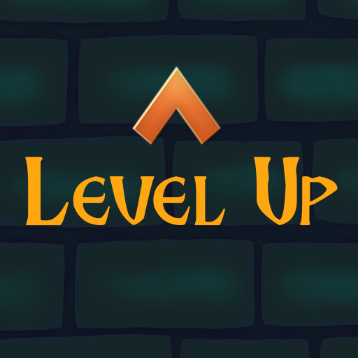
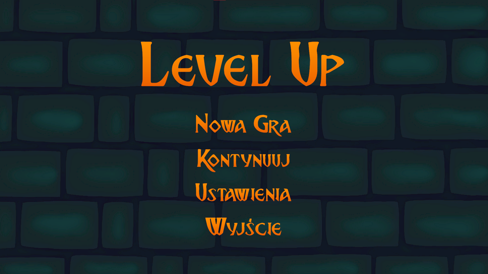
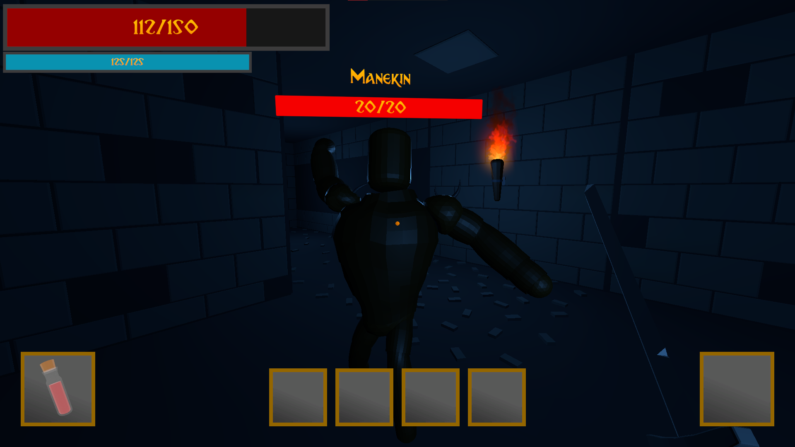
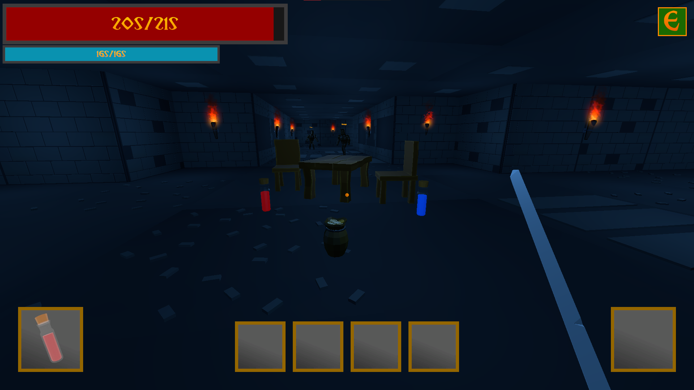
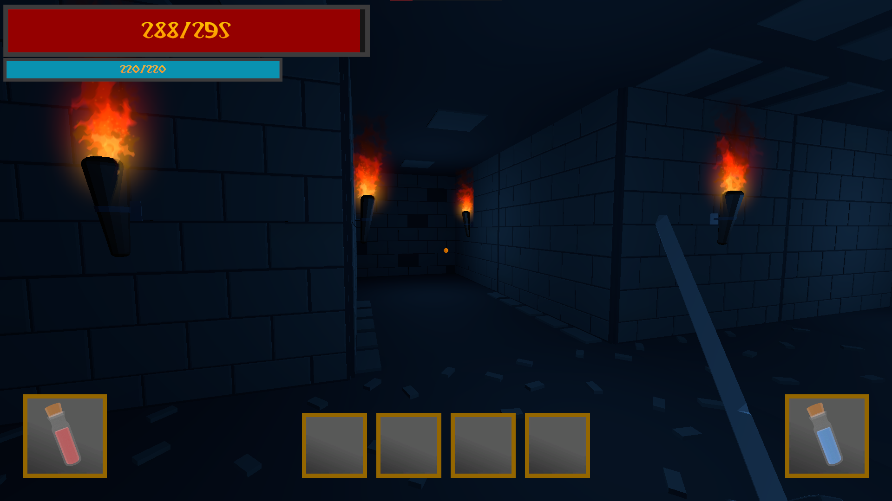
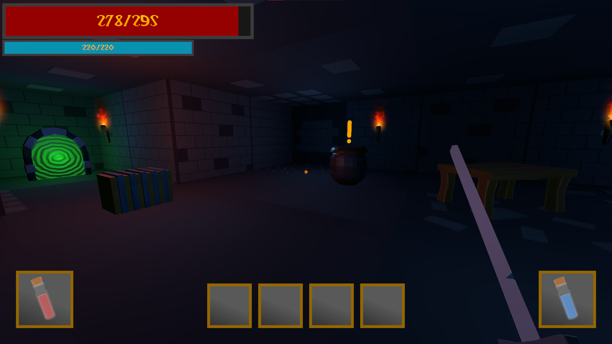

 
  

<h1 align="center"> Level Up </h1>

<h2>About The Project</h2>

 
  This project is an adventure RPG game, in which you can fight with various enemies on your exciting adventure. It is my first larger project in Unity. It implements most of the typical rpg style mechanics, such as inventory, combat, spells, upgrade tree, saves etc.

<h2>Instalation</h2>

<h3>Unity Project</h3>

- Clone the repository into your local machine
- Install the required Unity version
- Open the project

<h3>Release</h3>

- Download the release version
- Unpack the zip archive
- Launch the executable

<h2>Usage</h2>

- When the game is launched, players start main menu
- They can check out the settings, which also contain controls
- Then, they can either start a new game or continue by choosing one of the maximum of 3 save slots

<h3>Controls</h3>

- W/A/S/D - Movement
- E - Interact
- Q - Healing potion
- F - Mana potion
- TAB - Stats/Inventory/Skills/Abilities/Quests Panels
- LEFT SHIFT - Using/Selling multiple items at once
- ESC - Menu
- LMB - Basic Attack
- RMB - Special Attack
- 1-4 - Abilities

<h2>Gameplay Screenshots</h2>

  

  

  

  

  

